# NAME

ledgersmb-installer - An installer for LedgerSMB, targetting as many platforms as possible
on which the LedgerSMB server can run.

# SYNOPSIS

```bash
  ledgersmb-installer install --log-level=error --target=/srv/ledgersmb --version=1.12.0
```
# COMMANDS

## compute

```plain
  ledgersmb-installer compute --version=1.12.0
```

Computes the list of packages fulfilling the module dependencies.

**Note**: The computation currently does not take the module versions into account.

## download

## install

```plain
  ledgersmb-installer install --version=1.12.0
  ledgersmb-installer --version=1.12.0
```

Downloads, unpacks and installs the indicated version, if possible with the
necessary O/S packages.

## help

### Options

```plain
  --[no-]system-packages
  --target=<install directory>
  --local-lib=<installation directory for CPAN modules>
  --log-level=[fatal,error,warning,info,debug,trace]
  --[no-]verify-sig
  --version=<version>
```


# INSTALLER PROCESS

```mermaid
flowchart TD
    pre_A@{ shape: start }
    --> pre_A1(Check suitable running Perl)
    --> pre_A2(Check have perlbrew)
    --> pre_A3(Check running system Perl)
    --> pre_A5(Check have compiler)
    --> pre_A7(Check have C library headers)
    --> pre_A6(Check have make)
    --> pre_A4(Check have pg_config and Pg headers)
    --> pre_A8(Check have xml2-config and libxml2 headers)
    --> pre_B(Load platform support)
    pre_B --> pre_B1{Running system Perl}
    pre_B1 --> |Yes| pre_C{"Have precomputed deps<br>(implies suitable system perl)"}
    pre_B1 --> |No| pre_D
    pre_C --> |Yes| pre_C1{Can install pkgs}
    pre_C --> |No| pre_D(Compute all/full module deps)
    pre_C1 --> |Yes: check module builder| pre_K
    pre_C1 --> |No| pre_D
    pre_D --> pre_E{Running suitable perl}

    pre_E --> |Yes| pre_alpha{Running suitable **system** perl}
    pre_E --> |No| pre_beta{Have suitable perl}
    pre_beta --> |Yes| pre_gamma(Continue with suitable perl)
    pre_beta --> |No| pre_E1b
    pre_gamma --> pre_E1a

    pre_alpha --> |Yes: check module builder| pre_F{Can install pkgs && <br>Have 'pkg compute' prereqs}
    pre_alpha --> |No| pre_E1a{Have DBD::Pg}

    pre_E1a --> |Yes| pre_E2
    pre_E1a --> |No| pre_E1b{Have libpq prereq}
    pre_E1b --> |No| pre_E1c{Can install pkgs}
    pre_E1b --> |Yes| pre_E1d
    pre_E1c --> |No| pre_J(**bail**)
    pre_E1c --> |Yes| pre_E1d(Install libpq)
    pre_E1d --> pre_E2{Running suitable Perl}
    pre_E2 --> |No| pre_E2a(Install perlbrew)
    pre_E2 --> |Yes| pre_E2b{Have libxml2}
    pre_E2a --> pre_E2b
    pre_E2b --> |Yes| pre_M
    pre_E2b --> |No| pre_E3{Can install pkgs}
    pre_E3 --> |Yes| pre_E4(Install libxml2)
    pre_E3 --> |No| pre_E5(Install Alien::LibXML)
    pre_E4 --> pre_M
    pre_E5 --> pre_M

    pre_F --> |Yes| pre_H(Map pkg deps)
    pre_F --> |No| pre_E1a

    pre_H --> pre_K(Install packaged modules)
    pre_K --> pre_K2{Have unpackaged modules}
    pre_K2 --> |No| pre_Z
    pre_K2 --> |Yes| pre_M(Install CPAN modules)
    pre_M --> pre_Z
    pre_Z@{ shape: stop }
```


